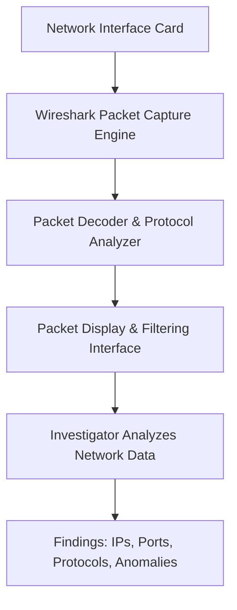

### NAME : MANOJ K
### REG NO : 212222223001
# EX 9 : Network-traffic-capture-and-analysis-with-Wireshark
## AIM:
To capture and analyze network traffic using Wireshark in order to observe protocols, packets, and potential anomalies.
## Requirements:
- **Hardware:**
    - Computer with internet access
    - Network adapter (Ethernet/Wi-Fi)
- **Software:**
    - Wireshark (latest stable version)
    - Sample PCAP files (optional for offline analysis)
## Architecture:

## DESIGN STEPS:
### Step 1:
Install Wireshark on the system.

### Step 2:
Launch Wireshark and select the network interface (Ethernet/Wi-Fi).

### Step 3:
Start the capture, apply filters (like http, tcp, ip.addr == x.x.x.x) to analyze specific traffic, and stop the capture after observing relevant data.
### Step 4:
**Analyze traffic to identify:**
  - Source & Destination IP addresses
  - Protocols (HTTP, DNS, TCP, UDP, etc.)
  - Suspicious activities (e.g., unusual ports, repeated requests).
## PROGRAM:
Wireshark Packet Capture and Filter Usage
## 1. Open Wireshark and Select a Network Interface
• Launch Wireshark.
• Select an active interface (like Wi-Fi or Ethernet) to start capturing packets.

## 2. Start Capturing Packets
• Click the blue shark fin icon or double-click the interface.
• Wireshark will start capturing all real-time traffic.

## 3. Apply Filters to Focus on Specific Traffic
• Use filters like http, ip.addr == 192.168.1.1, or tcp.port == 80 in the top filter
bar to narrow down results.

## 4. Analyze Packet Details
• Click on a packet to view its detailed breakdown including frame, Ethernet,
IP, TCP/UDP layers, and data payload.

## 5. Export or Save the Capture
• Go to File > Save As to store the capture in .pcap format for future analysis.

## OUTPUT:
Captured Packets with Protocol Analysis and Detailed Packet Info

## RESULT:
Network traffic was successfully captured and analyzed using Wireshark.
